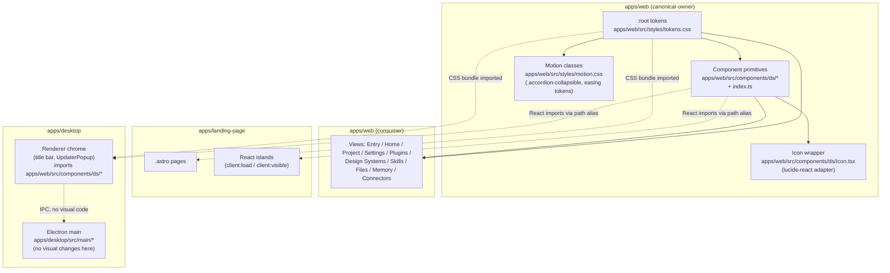
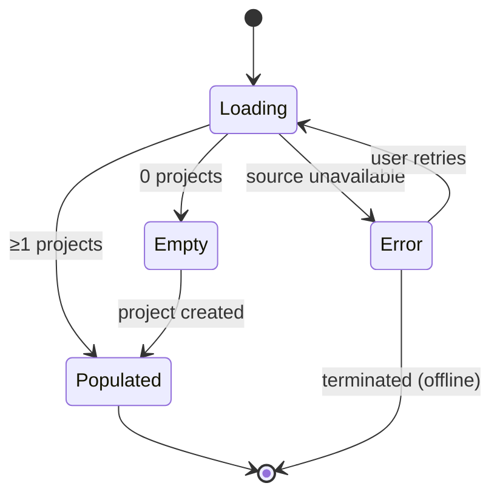
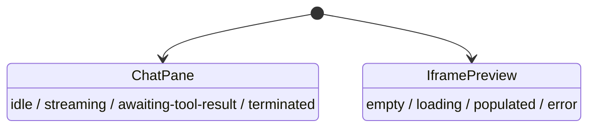
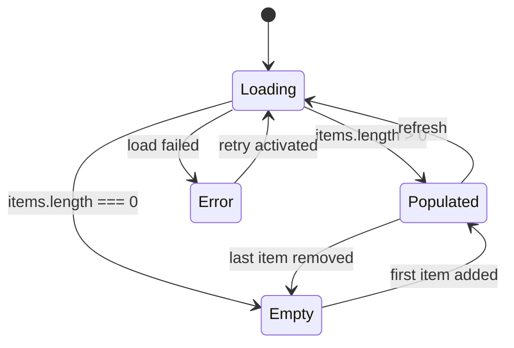

# Design Document

## Overview

This design replaces the visual surface of three Galyarder Design apps — `apps/web`, `apps/landing-page`, and `apps/desktop` — with one editorial-modern, agent-native design system. It is a from-scratch visual rewrite, not a polish pass: every screen is rebuilt against one token layer and one component library, with light/dark, RTL, CJK, density, and reduced-motion as first-class concerns.

The redesign honors three hard boundaries:

1. **Daemon and contract immutability.** Zero net changes to `apps/daemon/src/*-routes.ts` or `packages/contracts`. Every redesigned surface derives its presentation solely from existing response fields.
2. **Functional preservation.** Existing entry-point file paths, exported component names, and public prop signatures (names, types, optionality, defaults) are preserved so existing callers and tests compile without source changes. Specific behavior contracts — CJK detection patterns, URL-load vs srcDoc decision logic, dual-iframe simultaneous mount, `isOurIframe` and active-iframe receive filters, `latestTodoWriteInputFromMessages` source, `dedupeSnapshotToolRetries` semantics, and `onAnswerToolUse` live route preference — are preserved verbatim.
3. **i18n discipline.** Existing translated values in `apps/web/src/i18n/locales/*`, `apps/landing-page/app/_lib/i18n.ts`, and `apps/landing-page/app/_lib/home-copy.ts` stay read-only. Only key adds/renames/removes are allowed and all 17 web locales must move in lockstep.

The visual direction is editorial-modern (Linear × Stripe × Anthropic × Things 3): OKLch palette, strong typographic hierarchy, generous negative space, monospaced numerals for runtime telemetry, deliberate motion under the repo's existing UI animation philosophy (`cubic-bezier(0.23, 1, 0.32, 1)`, ~200ms enter / ~140ms exit, grid-row accordion, no `scale(0)`).

### Scope at a glance

| App | Surfaces redesigned | Approximate share |
|-----|--------------------|-------------------|
| `apps/web` | Entry view, Home view, Project view, Settings dialog, Plugin gallery + detail, Design-system gallery + preview, Skill picker + detail, File workspace, Updater + privacy + dialog system, Chat composer, Memory section, Connectors/automations rail, Iframe preview chrome, Empty + error states | ~90% |
| `apps/landing-page` | Hero, Capabilities grid, plugins/skills/design-systems index pages, tutorials/blog list + detail, footer, header (sticky/transparent + mobile hamburger) | ~7% |
| `apps/desktop` | Title bar (mac vibrancy / Windows controls / Linux fallback / unknown-OS fallback / unfocused), Updater popup, window minimum size, narrow-breakpoint collapse | ~3% |

## Architecture

### Ownership model



**Rules:**

- `apps/web` is the **canonical owner** of tokens, primitives, the icon adapter, and motion classes.
- `apps/landing-page` consumes primitives via Astro React islands using a TypeScript path alias to `apps/web/src/components/ds/*`. Astro's `client:load` / `client:visible` directives gate hydration; the static markup uses the same token CSS bundle so server-rendered HTML matches the hydrated React island.
- `apps/desktop` renders inside a chromium webview already loading the web app; the only desktop-private React surface is the title bar + `UpdaterPopup`, both of which import primitives from the canonical path.
- No primitive source is duplicated across apps. The boundary rule from `AGENTS.md` ("`apps/web/**` must not import `apps/daemon/src/**`") is upheld; landing-page and desktop importing `apps/web/src/components/ds/*` is allowed because `ds/*` is the explicit shared design surface, not private app internals.

### Token bridge

The token layer is a single `tokens.css` file under `apps/web/src/styles/tokens.css`, imported by:

- `apps/web/src/index.css` (web app, already the entry point).
- `apps/landing-page/app/globals.css` via `@import` resolved through Astro's Vite pipeline (path alias `@gd/tokens`).
- The desktop renderer's HTML page (which is the web app loaded over `od://` or `http://127.0.0.1:<webPort>`).

PostCSS / Tailwind utility surfaces in `apps/web` continue to compile; the design adds no new Tailwind config but exposes tokens as CSS variables consumable from utility classes (`bg-[var(--surface-1)]`) and from CSS modules.

### Bundle layout

```
apps/web/src/
  styles/
    tokens.css         # all design tokens (color, type, space, radius, shadow, motion, z-index, density)
    motion.css         # .accordion-collapsible + easing helpers (already present, extended)
  components/
    ds/
      index.ts         # single export module — every primitive name listed in Req 2.1
      Button.tsx
      IconButton.tsx
      ToggleGroup.tsx
      Switch.tsx
      Checkbox.tsx
      Radio.tsx
      TextInput.tsx
      Textarea.tsx
      Select.tsx
      Combobox.tsx
      Slider.tsx
      Tabs.tsx
      Segmented.tsx
      Card.tsx
      Sheet.tsx
      Dialog.tsx
      Drawer.tsx
      Popover.tsx
      Tooltip.tsx
      Toast.tsx
      Banner.tsx
      Badge.tsx
      Tag.tsx
      Chip.tsx
      Avatar.tsx
      Kbd.tsx
      Spinner.tsx
      Progress.tsx
      Skeleton.tsx
      EmptyState.tsx
      Pagination.tsx
      MenuList.tsx
      ContextMenu.tsx
      Breadcrumbs.tsx
      NavRail.tsx
      NavItem.tsx
      ScrollArea.tsx
      Icon.tsx          # lucide-react adapter; only icon surface allowed
      _internal/        # private helpers (style, focus ring, slot adapter); not re-exported
  components/           # existing screen components keep their paths; rewritten internals
    EntryView.tsx
    HomeView.tsx
    ProjectView.tsx
    ChatComposer.tsx
    SettingsDialog.tsx
    FileViewer.tsx
    file-viewer-render-mode.ts        # preserved verbatim
    PluginsView.tsx
    DesignSystemFlow.tsx
    MemorySection.tsx
    UpdaterPopup.tsx
    PrivacyConsentModal.tsx
  views/                # if a view source lives under views/ today, it stays there;
                        # otherwise the existing component folder location is preserved
```

Tests for primitives live at `apps/web/tests/components/ds/<Primitive>.test.tsx` per Requirement 2.6 and the repo boundary rule that tests sit in a `tests/` sibling to `src/`.

## Components and Interfaces

### 1. Token layer (`apps/web/src/styles/tokens.css`)

#### Color

12-step neutral ramp + accent / accent-2 / success / warning / danger / info families, all in OKLch with hex fallback. Light variant in `:root`, dark variant in `[data-theme="dark"]`.

```css
:root {
  /* Neutral 12-step ramp, indexed 0..11 (0 = lightest in light mode) */
  --neutral-0: #ffffff;  --neutral-0-oklch: oklch(100% 0 0);
  --neutral-1: #fafaf9;  --neutral-1-oklch: oklch(98.4% 0.002 95);
  --neutral-2: #f4f4f2;
  --neutral-3: #e9e9e6;
  --neutral-4: #d8d8d4;
  --neutral-5: #b8b7b1;
  --neutral-6: #8e8d86;
  --neutral-7: #6c6b65;
  --neutral-8: #4a4944;
  --neutral-9: #2c2b27;
  --neutral-10: #181714;
  --neutral-11: #0b0a08; --neutral-11-oklch: oklch(8% 0 0);

  /* Accent (primary) — Galyarder Design coral */
  --accent-1:  #fbeee5;
  --accent-6:  #c96442;
  --accent-7:  #b45a3b;
  --accent-fg: #ffffff;

  /* Accent-2 (secondary) — slate */
  --accent2-1: #eef1f5;
  --accent2-6: #2348b8;
  --accent2-7: #1d3a99;

  /* Status families — each with -bg / -border / -fg / -fg-strong */
  --success-bg:    #e8f7ee; --success-fg: #1f7a3a; --success-border: #c6ead2;
  --warning-bg:    #fff3e0; --warning-fg: #b26200; --warning-border: #f4dca0;
  --danger-bg:     #fdecea; --danger-fg:  #9c2a25; --danger-border:  #f5c6c2;
  --info-bg:       #e8efff; --info-fg:    #2348b8; --info-border:    #c8d6ff;

  /* Surface aliases (consumed by primitives so screens never name a step) */
  --surface-0: var(--neutral-0);   /* page bg */
  --surface-1: var(--neutral-1);   /* panel bg */
  --surface-2: var(--neutral-2);   /* subtle inset */
  --surface-3: var(--neutral-3);   /* hover */
  --border:    var(--neutral-3);
  --border-strong: var(--neutral-4);
  --text:        var(--neutral-10);
  --text-muted:  var(--neutral-7);
  --text-faint:  var(--neutral-6);
  --text-strong: var(--neutral-11);
}

[data-theme="dark"] {
  /* Inverted ramp: neutral-0 = darkest in dark mode */
  --neutral-0: #0b0a08;
  --neutral-1: #181714;
  /* … etc through --neutral-11: #ffffff */
  --surface-0: var(--neutral-0);
  --surface-1: var(--neutral-1);
  /* Status families re-tuned for dark contrast */
  --success-bg: #0f2a18; --success-fg: #4caf72; --success-border: #1a4028;
  /* … */
}
```

Existing tokens already in `apps/web/src/index.css` (`--bg`, `--bg-panel`, `--accent`, `--shadow-*`, `--radius-*`, `--text*`) are kept as **legacy aliases** that resolve through the new ramp — so unredesigned surfaces keep rendering during the staged rollout. Each legacy alias gets a `/* legacy: → --surface-N */` comment so guard can flag when a redesigned surface still references one.

#### Typography

Eleven styles, each declaring `font-family`, `font-size`, `line-height`, `font-weight`, `letter-spacing`. Sans family is **TBD between Inter, Geist, and General Sans** (see Open Questions §13). Mono family is **TBD between JetBrains Mono and Geist Mono**.

```css
:root {
  --font-sans: 'Inter', -apple-system, BlinkMacSystemFont, 'Segoe UI', sans-serif;       /* TBD: §13 */
  --font-mono: 'JetBrains Mono', ui-monospace, SFMono-Regular, Consolas, monospace;       /* TBD: §13 */

  /* Type scale */
  --type-display:      600 36px/1.1 var(--font-sans); --tracking-display: -0.02em;
  --type-h1:           600 28px/1.2 var(--font-sans); --tracking-h1: -0.015em;
  --type-h2:           600 22px/1.25 var(--font-sans);
  --type-h3:           600 18px/1.3 var(--font-sans);
  --type-h4:           600 15px/1.35 var(--font-sans);
  --type-body-lg:      400 16px/1.55 var(--font-sans);
  --type-body:         400 14px/1.5 var(--font-sans);
  --type-body-sm:      400 13px/1.5 var(--font-sans);
  --type-caption:      500 11.5px/1.4 var(--font-sans); --tracking-caption: 0.02em;
  --type-code:         400 13px/1.55 var(--font-mono);
  --type-mono-numeral: 500 13px/1.4 var(--font-mono);   /* tabular-nums; runtime telemetry */
}
```

The mono-numeral style adds `font-variant-numeric: tabular-nums` to keep runtime counters from jiggling.

#### Spacing

4-base scale, exposed as both indexed steps and semantic aliases.

```css
:root {
  --space-1:  4px;
  --space-2:  8px;
  --space-3: 12px;
  --space-4: 16px;
  --space-5: 20px;
  --space-6: 24px;
  --space-8: 32px;
  --space-10: 40px;
  --space-12: 48px;
  --space-14: 56px;
  --space-16: 64px;
  --space-20: 80px;
  --space-24: 96px;

  /* Semantic aliases (per Req 1.4) */
  --gutter:       var(--space-6);
  --section-gap:  var(--space-12);
  --card-padding: var(--space-5);
}
```

#### Radius

```css
:root {
  --radius-sm:   3px;     /* Req 1.5: 2..4 px */
  --radius-md:   6px;     /* default for primitives, Req 1.5: 4..8 */
  --radius-lg:  12px;     /* Req 1.5: 8..16 */
  --radius-full: 9999px;  /* pill */
}
```

#### Shadow

`resting` → `raised` → `floating`, each with light + dark variants per Req 1.6.

```css
:root {
  --shadow-resting:  0 1px 0 rgba(20, 20, 18, 0.04);
  --shadow-raised:   0 4px 12px rgba(20, 20, 18, 0.06), 0 1px 3px rgba(20, 20, 18, 0.04);
  --shadow-floating: 0 24px 60px rgba(20, 20, 18, 0.16), 0 8px 16px rgba(20, 20, 18, 0.07);
}
[data-theme="dark"] {
  --shadow-resting:  0 1px 0 rgba(0, 0, 0, 0.3);
  --shadow-raised:   0 4px 12px rgba(0, 0, 0, 0.45), 0 1px 3px rgba(0, 0, 0, 0.3);
  --shadow-floating: 0 24px 60px rgba(0, 0, 0, 0.65), 0 8px 16px rgba(0, 0, 0, 0.35);
}
```

#### Motion

```css
:root {
  --duration-snap:   100ms;
  --duration-base:   180ms;
  --duration-gentle: 240ms;
  --easing-standard: cubic-bezier(0.23, 1, 0.32, 1);

  /* Asymmetric durations per AGENTS.md */
  --duration-enter: 200ms;
  --duration-exit:  140ms;
}

@media (prefers-reduced-motion: reduce) {
  :root {
    --duration-snap:   0ms;
    --duration-base:   0ms;
    --duration-gentle: 0ms;
    --duration-enter:  0ms;
    --duration-exit:   0ms;
  }
}
```

`apps/web/src/styles/motion.css` keeps the existing `.accordion-collapsible` / `.accordion-collapsible-inner` pair (grid-template-rows 0fr→1fr) — rewritten only to consume the new motion tokens.

#### Z-index

```css
:root {
  --z-base:     0;
  --z-dropdown: 10;
  --z-sticky:   20;
  --z-overlay:  30;
  --z-modal:    40;
  --z-toast:    50;
}
```

Guard rule (Req 1.9): redesigned files MUST resolve any `z-index:` value through one of `var(--z-*)`. A `pnpm guard` rule scans `apps/{web,landing-page,desktop}/src/**/*.{ts,tsx,css}` plus `apps/landing-page/app/**/*.{ts,tsx,astro,css}` and fails on numeric `z-index` literals outside an explicit `// z-index: legacy` allowlist for not-yet-redesigned files.

#### Density

```css
:root {
  --density-multiplier: 1;
}
[data-density="compact"] {
  --density-multiplier: 0.85;
}
```

Primitives compute padding/gap as `calc(var(--space-3) * var(--density-multiplier))`. The provider clamps to `[0.75, 1.25]` and emits a dev-only `console.warn` on out-of-range values (Req 5.5). Persistence: `localStorage.galyarder.density`, hydrated synchronously before first paint via a tiny inline script in the document head.

#### Theme switching

- Root attribute: `<html data-theme="light" | "dark">`. Absence of the attribute means system mode (already the convention in the existing `apps/web/src/index.css`).
- Persistence: `localStorage.galyarder.theme = "light" | "dark" | "system"`. Hydrated by the same inline script that hydrates density, so the attribute is set before the first paint to avoid theme-flash.
- OS-pref fallback: when the persisted value is `"system"` or absent, the inline script sets `data-theme` from `window.matchMedia('(prefers-color-scheme: dark)').matches`.
- Switching: a `ThemeProvider` listens to user toggles in `SettingsDialog` and to OS changes when in system mode, and updates the attribute. CSS transitions on `background-color`, `color`, and `border-color` (240ms, easing-standard) on `body` and surface-hosting elements give a smooth swap (Req 4.3–4.5: ≤500ms).

#### File location and Tailwind/PostCSS bridge

- Canonical source: `apps/web/src/styles/tokens.css` (imported by `apps/web/src/index.css`).
- Landing-page bridge: `apps/landing-page/app/globals.css` adds `@import '@gd/tokens';` (Astro Vite resolves `@gd/tokens` via a tsconfig + Vite alias to `apps/web/src/styles/tokens.css`).
- Desktop bridge: desktop renderer loads the web URL — same tokens reach it for free. The desktop-private title-bar React surface is mounted into the same document and inherits tokens.
- Tailwind: keep current Tailwind config (no new theme plugin); reference tokens via arbitrary values (`bg-[var(--surface-1)]`).
- PostCSS: no new plugins. Existing pipeline already understands CSS custom properties and `color-mix()`.

### 2. Component library (`apps/web/src/components/ds/*`)

Every primitive ships:

- A typed React `forwardRef` declaration when it wraps a focusable or measurable DOM node.
- Tokens-only styling — zero hardcoded color/spacing/radius/shadow literals (guarded).
- A JSDoc `@example` block whose body type-checks (CI step that compiles examples).
- A unit test at `apps/web/tests/components/ds/<Name>.test.tsx` with at least one ref-forwarding assertion.
- Standard variant axes: `variant`, `size`, `density?`, plus primitive-specific props.

Every primitive is re-exported from `apps/web/src/components/ds/index.ts`:

```ts
export { Button } from './Button';
export { IconButton } from './IconButton';
// … one line per primitive in Req 2.1, in the order of that requirement.
export { Icon } from './Icon';
export type * from './types';
```

#### Primitive contracts

| Primitive | Headless source | Roles / keyboard | Variants / size | Notes |
|-----------|-----------------|------------------|-----------------|-------|
| `Button` | none (native `<button>`) | `role=button`; Enter/Space activate; Tab focusable | `variant: 'primary' \| 'secondary' \| 'ghost' \| 'danger'`; `size: 'sm' \| 'md' \| 'lg'`; `loading?`, `leadingIcon?`, `trailingIcon?` | forwards ref to button |
| `IconButton` | none | `role=button`; requires `aria-label` | same as Button + `iconOnly` always true | guard rejects render without `aria-label` |
| `ToggleGroup` | `@radix-ui/react-toggle-group` | `role=group` of `role=radio` (single) / `role=checkbox` (multiple); ←/→ navigate | `type: 'single' \| 'multiple'`, `size`, `density` | |
| `Switch` | `@radix-ui/react-switch` | `role=switch`, `aria-checked`; Space toggles | `size`, `disabled` | |
| `Checkbox` | `@radix-ui/react-checkbox` | `role=checkbox`, indeterminate via `data-state="indeterminate"` | `size` | |
| `Radio` | `@radix-ui/react-radio-group` | radiogroup pattern; ↑↓ navigate within group | `size` | |
| `TextInput` | none | textbox; Esc clears when `clearable` | `size`, `invalid?`, `leadingIcon?`, `trailingSlot?` | |
| `Textarea` | none | textbox multiline | `autoResize?`, `maxRows?` | |
| `Select` | `@radix-ui/react-select` | combobox + listbox; ↑↓ Enter | `size`, `placeholder` | uses `Popover` portal |
| `Combobox` | `cmdk` (already in repo) wrapped | combobox with type-ahead | `size`, `emptyState` | filtered list with virtualization opt-in |
| `Slider` | `@radix-ui/react-slider` | slider; ←/→/Home/End | `min`, `max`, `step`, `marks?` | |
| `Tabs` | `@radix-ui/react-tabs` | tablist; ←/→ between tabs, Tab into panel | `orientation` | |
| `Segmented` | `@radix-ui/react-toggle-group` (`type=single`) | radiogroup pattern | `size`, `density` | visual variant of ToggleGroup; sugar |
| `Card` | none | container; not interactive unless `as="button"` | `padding`, `elevation: 'flat' \| 'resting' \| 'raised'` | |
| `Sheet` | `@radix-ui/react-dialog` (side variant) | dialog with focus trap, Esc close | `side: 'top' \| 'right' \| 'bottom' \| 'left'`, `size` | |
| `Dialog` | `@radix-ui/react-dialog` | modal dialog, focus trap, Esc close | `size`, `dismissable: boolean` (false for privacy modal) | |
| `Drawer` | `vaul` | mobile-first sheet with drag-to-dismiss | `direction` | |
| `Popover` | `@radix-ui/react-popover` | non-modal; Esc closes | `align`, `side`, `sideOffset` | |
| `Tooltip` | `@radix-ui/react-tooltip` | role=tooltip, ~500ms delay | `side`, `align` | |
| `Toast` | `sonner` | aria-live=polite | `variant: 'info' \| 'success' \| 'warning' \| 'danger'`, `duration` | mounted once via `<Toaster/>` in app root |
| `Banner` | none | `role=status` (info) or `role=alert` (danger) | `variant`, `dismissable?` | inline, not stacked |
| `Badge` | none | inline, decorative | `variant`, `size` | |
| `Tag` | none | `role=button` if removable | `removable?` | |
| `Chip` | none | selectable; checked state via aria-pressed | `selected?`, `size` | |
| `Avatar` | none | `img` with fallback initials | `size`, `shape: 'circle' \| 'square'` | |
| `Kbd` | none | inline kbd token | `size` | |
| `Spinner` | none | `role=status`, `aria-label` required | `size`, `variant` | |
| `Progress` | `@radix-ui/react-progress` | `role=progressbar`; aria-valuenow | `value`, `indeterminate?` | |
| `Skeleton` | none | `aria-hidden`; respects reduced-motion | `width`, `height`, `radius` | shimmer disabled under reduced-motion |
| `EmptyState` | none | composed of icon, title, description, primary action | `icon`, `title`, `description`, `action` | one canonical layout |
| `Pagination` | none | `nav` with `aria-label`; ←/→ keys | `total`, `page`, `pageSize` | |
| `MenuList` | `@radix-ui/react-dropdown-menu` | menu; ↑↓ Enter, Esc | `align`, `side` | |
| `ContextMenu` | `@radix-ui/react-context-menu` | contextmenu; same keys as MenuList | | |
| `Breadcrumbs` | none | `nav aria-label`; separator `aria-hidden` | `items` | |
| `NavRail` | none | `nav`; vertical Tab order | `collapsed?`, `density` | desktop narrow-breakpoint collapses |
| `NavItem` | none (inside NavRail) | role=link or button; current page = `aria-current="page"` | `icon`, `label`, `active?` | |
| `ScrollArea` | `@radix-ui/react-scroll-area` | `role=region` when labeled | `viewportClassName?` | |
| `Icon` | `lucide-react` (only) | `aria-hidden` unless `aria-label` provided | `name: keyof Icons`, `size: 16 \| 20 \| 24`, `strokeWidth = 1.5` | enforced by guard |

**Public prop signature shape.** Every primitive uses the same shape:

```ts
type Variant<V> = { variant?: V };
type Size = { size?: 'sm' | 'md' | 'lg' };
type Density = { density?: 'comfortable' | 'compact' };
type AsChild = { asChild?: boolean }; // for primitives wrapping a single element

type ButtonProps =
  React.ButtonHTMLAttributes<HTMLButtonElement>
  & Variant<'primary' | 'secondary' | 'ghost' | 'danger'>
  & Size & Density & AsChild
  & {
    loading?: boolean;
    leadingIcon?: IconName;
    trailingIcon?: IconName;
  };

export const Button = React.forwardRef<HTMLButtonElement, ButtonProps>(/* … */);
```

Test coverage for ref forwarding (one canonical pattern):

```ts
import { render } from '@testing-library/react';
import { createRef } from 'react';
import { Button } from '../../../src/components/ds';

test('Button forwards ref to underlying button element', () => {
  const ref = createRef<HTMLButtonElement>();
  render(<Button ref={ref}>Hello</Button>);
  expect(ref.current).toBeInstanceOf(HTMLButtonElement);
});
```

#### Hardcoded-literal lint rule (`pnpm guard`)

Two new guard rules under `scripts/guard.ts`:

1. `no-hardcoded-style-literals-in-ds`: scans `apps/web/src/components/ds/**/*.{ts,tsx,css}` for hex literals (`#[0-9a-f]{3,8}`), pixel literals not multiples of `var(--space-*)`, raw `box-shadow:` definitions, and raw `border-radius:` numeric values; fails with file/line/literal.
2. `icon-source-and-size`: scans `apps/{web,landing-page,desktop}/**/*.{ts,tsx,astro}` for icon imports — only `lucide-react` allowed (Req 3.1) — and checks that any icon usage carries `size={16|20|24}` and `strokeWidth={1.5}` (Req 3.2–3.3). Includes an allowlist for `apps/web/src/components/ds/Icon.tsx` itself.

Both rules append to the existing guard pipeline; no new top-level dependency.

### 3. Iconography

`apps/web/src/components/ds/Icon.tsx` is a thin adapter:

```tsx
import * as Lucide from 'lucide-react';
export type IconName = keyof typeof Lucide; // narrowed at build time

export const Icon = forwardRef<SVGSVGElement, IconProps>(({ name, size = 20, strokeWidth = 1.5, label, ...rest }, ref) => {
  const Cmp = Lucide[name] as React.ComponentType<LucideProps>;
  return <Cmp ref={ref} size={size} strokeWidth={strokeWidth} aria-hidden={label ? undefined : true} aria-label={label} {...rest} />;
});
```

- Sizes locked at `16 | 20 | 24` (Req 3.2). Default `20` for body-row UI; `16` for inline next to caption text; `24` for primary nav rail.
- Stroke width locked at `1.5` (Req 3.3).
- Single import source: `lucide-react`. Guard rejects icons from any other package (Req 3.1).
- Existing `apps/web/src/components/Icon.tsx` is rewritten to delegate to `ds/Icon.tsx` so existing call sites compile unchanged; over time call sites migrate to `ds/Icon`.

### 4. Web app screen designs

For each redesigned screen: information architecture (IA), state machine, component composition, file path, preserved invariants, keyboard contract, empty + error mapping. Path notation `apps/web/src/...` is implicit unless the requirements specify otherwise.

#### 4.1 Entry View (Req 10) — `components/EntryView.tsx`

**IA.** Single-column hero with a primary CTA "Create project" rendered as `Button variant=primary size=lg`. Secondary list of existing projects below the hero, scrollable, ordered most-recently-updated first, rendered as `Card`s with `MenuList` for per-project actions. Right-rail recents and helper menu re-use the existing `EntryNavRail` / `EntryHelpMenu` components but rewired to `ds/*` primitives.

**State machine.**



**Composition.** `EntryShell` wraps the view (existing pattern). Hero block uses `Button` + helper text via `Banner` if there is a non-blocking notice. Empty state uses `EmptyState` primitive. Error state uses `Banner variant=danger` plus `Button` retry — distinct from `EmptyState` per Req 23.4.

**Preserved invariants.** Exported component name `EntryView`, public prop signature unchanged (Req 10.2). The pre-redesign `connectorLifecycle` and `sortConnectorsForSearch` exports remain.

**Keyboard contract.** Tab order: hero CTA → search field (if present) → first project card → … → settings. All cards activate on Enter/Space. Escape on a card menu closes that menu only.

**Empty / error.** Empty: `EmptyState{ icon: 'plus-square', title: 'No projects yet', description: '…', action: <Button>Create project</Button> }`. Error: per Req 24 patterns; daemon-down → API-key-missing → CLI-not-found.

#### 4.2 Home View (Req 11) — `components/HomeView.tsx`

**IA.** Two-pane layout. Leading pane `ChatPane` (chat composer + conversation transcript) clamped 30–70% of viewport, ≥320 px. Trailing pane `Iframe_Preview` chrome with control bar (zoom, device frame, render-mode toggle, comment side panel, tweaks panel toggle). Pane divider is a draggable `Slider`-styled splitter using `aria-orientation="vertical"` and `role="separator"`.

**State machine.**



The two are independent state machines that never mutate each other directly — they communicate via existing message channels (`postMessage` filtered by `isOurIframe`).

**Composition.** Existing `HomeView.tsx` keeps its top-level shape; internals migrate to `ds/*` (`Tabs` for the right-pane control bar, `ToggleGroup` for zoom presets, `Segmented` for render-mode). `HomeHero.tsx` is rewritten using `Card` + `Button` + `Icon` while preserving the home-hero CJK detection patterns verbatim.

**Preserved invariants.** Exported `HomeView` component name and prop signature (Req 11.3). CJK detection patterns in `HomeView.tsx` and `HomeHero.tsx` preserved verbatim including their English annotations (Req 7.6, Req 11.4). Drag preserves Iframe document/scroll/JS state (Req 11.5) — the divider only resizes via CSS grid template columns; iframes are never re-mounted.

**Keyboard contract.** Tab order: NavRail → ChatPane composer → submit → divider (with role=separator handling ←/→ to resize) → preview controls → iframe focus area. Esc in a tool card closes the tool form; Esc on the iframe focus area returns focus to ChatPane.

#### 4.3 Project View (Req 12) — `components/ProjectView.tsx`

**IA.** Single workspace surface. Three reachable surfaces inside the view chrome (no modals): `FileWorkspace` (left), `Iframe_Preview` (center), and a right rail with `Tabs` exposing Design Systems / Skills / Tweaks. Bottom strip is the `ChatComposer` again so users can iterate without leaving the view.

**State machine.** Each of the three sub-surfaces (file viewer, gallery picker, skill picker, tweaks panel) has its own loading / populated / error state (Req 12.5). A failure in one surface does not block the others.

**Composition.** Right rail uses `Tabs`. Each tab body is a `ScrollArea` containing a `Card` grid. Tweaks panel uses `Slider`, `ToggleGroup`, `TextInput`. File viewer uses existing `FileViewer.tsx` + `FileWorkspace.tsx` rewired through `ds/*`.

**Preserved invariants.** Exported `ProjectView` component name and prop signature (Req 12.3). CJK detection patterns in `ProjectView.tsx` preserved verbatim (Req 7.6, Req 12.4).

**Keyboard contract.** Tab order: file list → file viewer → preview controls → right-rail tabs (Tab into list, ↑↓ within) → composer.

#### 4.4 Settings Dialog (Req 13) — `components/SettingsDialog.tsx`

**IA.** Dialog with five clearly labeled sections: Privacy, Execution Mode, Model, Locale, Telemetry. Sections are vertical sub-rail (`NavRail` collapsed=false at md+, accordion at narrow widths). Section panes use `ScrollArea`.

**State machine.** Open / closed; each section has its own dirty state. Save is per-section to keep blast radius small.

**Composition.** Built on `Dialog` primitive (Req 18.1). Settings surface uses `ToggleGroup` (theme), `Select` (model), `Combobox` (locale), `Switch` (telemetry).

**Preserved invariants.** Exported component name `SettingsDialog` and prop signature unchanged (Req 13.2).

**Keyboard contract.** Open via Enter/Space on the entry control. Initial focus on first interactive control. Tab/Shift+Tab cycles within dialog. Esc closes (Req 13.5). Reachable in ≤10 Tabs from entry view first focusable (Req 13.3).

#### 4.5 Plugin Gallery + Detail Modal (Req 14) — `components/PluginsView.tsx`

**IA.** Responsive grid of plugin cards (`Card` with `Badge` for category). Activating a card opens `PluginDetailsModal` (built on `Dialog`).

**State machine.** Loading → Populated → Empty (Req 23) → Error (Req 14.4). Modal: closed → open → submitting → installed.

**Composition.** Grid uses CSS grid + `--space-6` gutter. Detail modal uses `Dialog` body with `Tabs` for description / inputs / changelog.

**Preserved invariants.** Exported `PluginsView` component name and prop signature unchanged (Req 14.3). Modal returns focus to opening card on close (Req 14.6).

#### 4.6 Design System Gallery + Preview (Req 15) — `components/DesignSystemFlow.tsx`

**IA.** Card grid + side-by-side preview drawer that does not unmount the grid (Req 15.2). Activating a card opens a `Sheet` (side="right") with the full preview.

**Composition.** `Card` + `Avatar` (system mark) + `Badge` for status. Preview rail uses `ScrollArea` and `Tabs` for Tokens / Components / Patterns. Empty/error matches Req 23 / Req 24.

**Preserved invariants.** Exported `DesignSystemFlow` component name and prop signature unchanged (Req 15.3).

#### 4.7 Skill Picker + Detail (Req 16) — `components/SkillsSection.tsx` (existing surface) wired through `ds/*`

**IA.** Card grid. Activating a skill opens a detail surface (`Sheet` side="right") with name, description, input parameters (`TextInput` / `Combobox` / `Switch`), and an Apply `Button`.

**State machine.** Loading → Populated → Empty → Error. Detail: hidden → visible → applying → applied/error.

**Composition.** Grid mirrors the plugin gallery for visual consistency. Skill detail dismiss returns focus to the previously activated card (Req 16.5).

#### 4.8 File Workspace (Req 17) — `components/FileWorkspace.tsx` + `FileViewer.tsx` + `file-viewer-render-mode.ts`

**IA.** Left pane: file list as `MenuList`-style stack inside `ScrollArea`. Right pane: viewer surface. Top bar of viewer holds hand-off `Button` + `Tooltip`-wrapped action buttons.

**Preserved invariants (CRITICAL).**

- `apps/web/src/components/file-viewer-render-mode.ts` preserved **verbatim** (Req 17.5). The redesign does not edit this file. Its `UrlLoadDecision` shape and `decideRenderMode()` function continue to govern URL-load vs srcDoc.
- Dual iframe simultaneous-mount is preserved (Req 22.3). The redesign rewrites the surrounding chrome; the two `<iframe>` elements stay mounted simultaneously, only CSS visibility is toggled. `iframeRef.current` continues to follow the active iframe via the existing `useEffect`.
- Receive filters preserved verbatim: `isOurIframe(ev.source)` for general acceptance; `ev.source === iframeRef.current?.contentWindow` for active-iframe-only signals (Req 22.4–22.5).
- `FileViewer` exported component name and prop signature unchanged (Req 17.4).

**Keyboard contract.** Up/Down moves through the file list. Enter opens the file. Tab moves into the viewer. Hand-off `Button` is reachable from viewer top bar.

#### 4.9 Updater + Privacy Consent + Dialog System (Req 18) — `components/PrivacyConsentModal.tsx`, plus the dialog queue

**IA.** Single Dialog primitive serves all modals: updater, privacy consent, "are you sure" confirms. A small `dialogQueue` provider gates concurrent opens to one-at-a-time (Req 18.5).

**Privacy modal specifics (Req 18.2–18.3).** Three controls in tab order: Accept (primary, affirmative verb), Decline (secondary, negative verb), Privacy details link (opens new tab). Stored in `localStorage.galyarder.privacy.consent`. Escape ignored on this modal only; all others honor Esc.

**Composition.** `Dialog` + `Banner variant=info` for the explainer, `Button` for actions. Backdrop is a token-driven overlay at `z-overlay` with single instance.

#### 4.10 Chat Composer (Req 19) — `components/ChatComposer.tsx` + `ChatPane.tsx`

**IA.** From top to bottom: pinned `TodoCard` slot (existing `PinnedTodoSlot`), composer textarea (`Textarea` autoResize), action row (model switcher `Select`, attachment `Button`, submit `Button`).

**Preserved invariants (CRITICAL).**

- Exported `ChatComposer` component name and prop signature unchanged (Req 19.1).
- Pinned `TodoCard` sourced from `latestTodoWriteInputFromMessages` exactly once via `PinnedTodoSlot` (Req 19.2). `AssistantMessage.stripTodoToolGroups` keeps stripping per-message TodoWrite groups — the pinned slot is the only on-screen TodoCard.
- TodoCard progress count formatted `<completed+in_progress>/<total>` (Req 19.3) — already the existing semantics; preserved.
- `AskUserQuestionCard` prefers `onAnswerToolUse(toolUseId, content)` while the run is active; falls back to `onSubmitForm(text)` after termination (Req 19.4–19.5). Selection chips persist via `tool_result.content` parse (existing behavior).
- `dedupeSnapshotToolRetries` semantics preserved: collapse identical `AskUserQuestion` retries by unique input keeping latest `tool_use_id`, render only most-recent `TodoWrite` snapshot (Req 19.7).
- Tool-result blocks use `Card` + monospaced typography (`var(--type-code)`) + a copy-to-clipboard `IconButton` that confirms with a transient `Toast` within 1500 ms (Req 19.8).

**Keyboard contract.** Shift+Enter newline; Enter submits (existing). Esc cancels current draft modifications. `↑` from empty composer recalls last user message. AskUserQuestion chips: `←/→` moves between options; Enter submits.

#### 4.11 Memory Section (Req 20) — `components/MemorySection.tsx`

**IA.** Header with `TextInput` search (max 200 chars, debounced 300 ms) and `Button variant=danger` Prune action. Body is a virtualized list of saved facts as `Card`s.

**State machine.** Loading → Empty (Req 23) → Populated → Filtering → ConfirmPrune → Pruning → Pruned/Error.

**Composition.** Confirm prune uses `Dialog` showing count. Toast confirms success. Empty state disables search and prune (Req 20.2).

#### 4.12 Connectors and Automations Rail (Req 21) — `components/ConnectorsBrowser.tsx` + `RoutinesSection.tsx`

**IA.** Two sections, each as a labeled group (`<section aria-labelledby>`). Connector entries: name + status `Badge` + primary `Button`. Automation entries: name + last-run timestamp (`Caption` style) + primary `Button`.

**State machine.** Per-section: loading → populated → empty → error. Errors per-section, the other section stays interactive (Req 21.5).

**Composition.** Section headers are `h2` with `--type-h2`. Lists use `Card` rows with `Avatar` for connector logo (existing `ConnectorLogo`).

**Keyboard contract.** Tab through section headings + entry primary actions in visual order with visible focus ring (Req 21.3–21.4). Enter/Space activates focused primary action.

#### 4.13 Iframe Preview Chrome (Req 22) — adjacent to `FileViewer.tsx`

**IA.** Single control bar at top: zoom `Segmented` (50/75/100/125/150/200, default 100), device frame `Select` (desktop 1280×800 / tablet 768×1024 / mobile 375×667, default desktop), render-mode `ToggleGroup` (URL / srcDoc), comment side-panel `IconButton`, tweaks panel `IconButton`.

**Preserved invariants (CRITICAL).** Dual-iframe simultaneous mount, `isOurIframe` general filter, `ev.source === iframeRef.current?.contentWindow` active-iframe filter (Req 22.3–22.5). Toggling render mode swaps CSS visibility only — no remount, no flash. Zoom / device-frame / render-mode / panel toggles apply within 200ms (Req 22.6–22.7) without remount.

#### 4.14 Empty States (Req 23) — `components/ds/EmptyState.tsx`

**IA.** One canonical layout: small `Icon` (size 24) + title (≤60 chars, `--type-h3`) + description (≤200 chars, `--type-body-sm`, `--text-muted`) + at least one primary `Button` action that initiates first-item creation. Per-view variants are configured by the caller; the primitive itself is unchanged.

**Mapping table.**

| View | Title | Action |
|------|-------|--------|
| Projects | "No projects yet" | "Create project" |
| Plugins | "No plugins available" | "Browse plugins" or refresh |
| Design Systems | "No design systems" | "Browse design systems" |
| Skills | "No skills available" | "Refresh" |
| Memory | "No saved facts" | "Add a fact" (disabled until first chat) |

#### 4.15 Error States (Req 24)

Distinct from empty (Req 23.4). Each error state is a `Banner variant=danger` (inline) when local, or a centered `Card` with `EmptyState`-shaped composition when full-pane.

| Trigger | Title | CTA |
|---------|-------|-----|
| Daemon down (no health within 5s, or connection refused) | "Daemon not reachable" | `Button` Retry |
| API key missing | "API key required: `<KEY_NAME>`" | `Button` Open Settings → focuses the key field |
| Agent CLI not found on PATH | "Agent CLI not found: `<NAME>`" | `Button` Open Settings → focuses CLI config field |
| Build failed | "Build failed" + truncated message (≤2000 chars) | `Button` Re-run with original parameters |

Retry/re-run dismisses the error and reflects the new attempt's outcome (Req 24.5).

### 5. Landing page design (`apps/landing-page`)

#### 5.1 Hero (Req 25)

**IA.** Single-column hero with: positioning sentence (40–140 chars), exactly one demo asset (image OR video, mutually exclusive), two CTAs labeled exactly "Download Desktop" and "Browse Skills".

**Composition.** Native Astro markup for static text. CTAs are React islands using `Button` from `@gd/ds` with `client:load`. Demo asset uses `<picture>` for image or `<video preload=metadata>` for video.

**Tone.** No emoji, no exclamation, none of the seven banned superlatives (Req 25.4 / Req 40). No Atelier Zero residue (Req 25.3 / Req 41).

#### 5.2 Capabilities grid (Req 26)

**IA.** Grid of 3–8 cells; each cell is `<article>` with label (1–40 chars) + example (1–140 chars). Anchor target `#capabilities` always present even when content fails to load.

**Composition.** `Card` from `@gd/ds` as React islands with `client:visible`. At ≤768 px viewport, single column.

#### 5.3 Index pages: plugins / skills / design-systems (Req 27)

**Paths.** `apps/landing-page/app/pages/plugins/index.astro`, `.../skills/index.astro`, `.../systems/index.astro` (latter two already exist; `plugins/` is added).

**IA.** List/grid of entries. Each entry: name + description (≤200 chars) + thumbnail. Activating an entry navigates to a detail page served from the public web — no desktop required (Req 27.4). Empty + not-found fallbacks (Req 27.5–27.6).

**Composition.** Static Astro for SEO + crawlability. Optional client islands (`Combobox` for filters when added; out of scope for this phase).

#### 5.4 Tutorials and blog (Req 28)

**IA.** List page with title (≤80), publish date, summary (≤200). Detail page has a measure-locked reading column (60–75 cpl from 320 to 1920 px), and an in-page TOC when ≥5 top-level sections.

**Composition.** Astro markdown content collection (already present). TOC is a small React island using `ds/Breadcrumbs`-style nav for jump-to-heading; rendered only when the heading count threshold is met.

#### 5.5 Footer (Req 29)

**IA.** Exactly five elements: brand mark, repository link, license indicator, contact link, locale switcher. Static Astro markup; no marketing residue (Req 29.2). Per-element fallback indicator if a dependency fails (Req 29.4).

#### 5.6 Header (Req 30)

**IA.** Fixed top header. Transparent over hero (alpha 0). Solid surface token over scrolled body (alpha 1). Transition 200 ms with easing-standard. Mobile hamburger disclosure under the design system breakpoint (`--breakpoint-md = 768px`).

**Composition.** Static markup + a small enhancer island (`apps/landing-page/app/_components/header-enhancer.astro` already exists). The enhancer adds a scroll listener that toggles a `data-state="solid" | "transparent"` attribute on the header element; CSS reads that attribute and animates `background-color`, `border-bottom-color`. The hamburger is `IconButton` + `Sheet` (`ds/*`).

#### 5.7 React-island consumption pattern

```astro
---
import { Button } from '@gd/ds';
---
<Button variant="primary" size="lg" client:load>Download Desktop</Button>
```

The `@gd/ds` alias resolves through `apps/landing-page/tsconfig.json` `paths` and `astro.config.ts` Vite alias to `apps/web/src/components/ds/index.ts`. No primitive duplication.

### 6. Desktop chrome (`apps/desktop`)

#### 6.1 Title bar (Req 31)

A new renderer component lives at `apps/desktop/src/renderer/TitleBar.tsx` (renderer-only — main process untouched per Req 31.6).

**Platform branches.**

| Platform | Frame | Controls | Title alignment | Background |
|----------|-------|----------|-----------------|------------|
| `darwin` | frameless | traffic lights leading (Electron native) | centered | vibrancy via `BrowserWindow.setVibrancy('hud')` (already wired via main if available) |
| `win32` | platform | min/max/close trailing (Electron native overlay) | leading | `--surface-1` |
| `linux` | platform | per WM convention | leading | `--surface-1` |
| unknown | linux fallback | linux fallback | leading | `--surface-1` |

**Unfocused style.** While `window.matchMedia('(window-state: inactive)')` (or the equivalent `electron`-supplied focus event) reports unfocused, title text uses `--text-muted` and the title-bar background drops one surface step. Contrast holds ≥3:1 (Req 31.4).

**Title text.** Always exactly `Galyarder Design` (Req 31.5 / Req 41.3).

#### 6.2 Updater popup (Req 32) — `apps/web/src/components/UpdaterPopup.tsx`

The requirements text says `apps/desktop/src/UpdaterPopup.tsx`; the existing repo file is at `apps/web/src/components/UpdaterPopup.tsx`. The redesign keeps the existing file path (the requirement allows the existing equivalent file). Public prop names, types, and required/optional status preserved (Req 32.3).

**IA.** `Dialog` body with: version badge (`Badge`) + release date caption + release-notes Markdown rendered with distinct typographic styles (h1/h2/h3/p/ul drawn from `--type-*` tokens). Dismiss via close `IconButton` + Esc (Req 32.4). Empty/parse-fail fallback message + version/dismiss still shown (Req 32.5).

#### 6.3 Window minimum size and narrow breakpoint (Req 33)

- `BrowserWindow` `minWidth: 1024`, `minHeight: 720` (Req 33.1, Req 33.4).
- Web-side responsive rule: at viewport width ≤ `--breakpoint-md` (768 px) the secondary `NavRail` collapses; at ≥md it stays expanded. `NavRail` reads `prefers-reduced-motion` and either animates the collapse via grid-template-columns or snaps with `--duration-snap = 0` under reduced motion.
- No horizontal clipping at any width ≥320 px (Req 7.3, Req 33.3).

## Data Models

This redesign touches presentation only. No new shared data shapes are introduced. The redesign reads:

- **Daemon API responses** through existing `packages/contracts` types (immutable per Req 35).
- **Local UI state** via existing providers in `apps/web/src/providers/*` and React state.

Two **internal-only** UI types are added under `apps/web/src/components/ds/types.ts`:

```ts
export type Size = 'sm' | 'md' | 'lg';
export type Density = 'comfortable' | 'compact';
export type ButtonVariant = 'primary' | 'secondary' | 'ghost' | 'danger';
export type BannerVariant = 'info' | 'success' | 'warning' | 'danger';
export type IconSize = 16 | 20 | 24;
export type IconName = keyof typeof import('lucide-react');
```

Three **internal-only** persistence keys are added to `localStorage` (no contract surface):

| Key | Values | Default |
|-----|--------|---------|
| `galyarder.theme` | `'light' \| 'dark' \| 'system'` | `'system'` |
| `galyarder.density` | `'comfortable' \| 'compact'` | `'comfortable'` |
| `galyarder.privacy.consent` | `'accepted' \| 'declined'` | unset (modal shown) |


## Correctness Properties

*A property is a characteristic or behavior that should hold true across all valid executions of a system — essentially, a formal statement about what the system should do. Properties serve as the bridge between human-readable specifications and machine-verifiable correctness guarantees.*

The following property set has been reduced via property reflection: redundant or subsumed candidates from the prework have been merged. Each remaining property carries unique validation value and cites the requirements it validates.

### Property 1: Token referential integrity

*For all* CSS / TS / TSX / Astro source files in `apps/{web,landing-page,desktop}/**` that reference a CSS custom property via `var(--TOKEN)`, the token name `TOKEN` is defined in the canonical `apps/web/src/styles/tokens.css` (under `:root` or `[data-theme="dark"]` or `[data-density="compact"]`). Conversely, *for all* semantic aliases (`--gutter`, `--section-gap`, `--card-padding`), the alias resolves to one of the discrete `--space-*` scale values.

**Validates: Requirements 1.4, 1.10, 1.11**

### Property 2: Z-index scale is strictly ordered and gates literals

*For all* pairs (i, j) of named z-index tokens with i declared before j in the named tier order (`base`, `dropdown`, `sticky`, `overlay`, `modal`, `toast`), the resolved numeric value of token i is strictly less than that of token j. *For all* redesigned source files, every `z-index:` declaration resolves through one of `var(--z-*)`; any numeric literal outside the allowlist fails `pnpm guard`.

**Validates: Requirements 1.8, 1.9**

### Property 3: Theming completeness and contrast

*For all* tokens in the categories color, shadow, border, and surface, both `:root` (light) and `[data-theme="dark"]` declare a non-null value. *For all* (text-color, surface-color) pairs declared by the token model, the WCAG contrast ratio is ≥ 4.5:1 for body text below 18 pt, ≥ 3:1 for body text at or above 18 pt, and ≥ 3:1 for interactive controls and focus indicators, in both light and dark modes.

**Validates: Requirements 4.1, 4.2, 4.6, 8.1**

### Property 4: Density multiplier clamping

*For all* values v assigned to `--density-multiplier` (programmatically or via CSS), the active multiplier resolves to `max(0.75, min(1.25, v))`, and a development-only warning is emitted when v lies outside `[0.75, 1.25]`.

**Validates: Requirements 5.5**

### Property 5: Motion-token discipline (easing, durations, scale floor, reduced-motion)

*For all* CSS transitions and keyframes declared in redesigned source files: (a) `transition-timing-function` equals `var(--easing-standard)` unless an inline comment at the declaration site documents an alternate easing; (b) enter durations lie in `[190, 210]` ms and exit durations in `[130, 150]` ms; (c) no keyframe rule contains `scale(s)` with `s < 0.9`; (d) under `prefers-reduced-motion: reduce`, every `--duration-*` token resolves to `0ms`.

**Validates: Requirements 6.1, 6.2, 6.4, 6.5, 8.6**

### Property 6: Iconography discipline

*For all* source files in `apps/{web,landing-page,desktop}/**`, every icon-shaped import resolves to `lucide-react`. *For all* `<Icon …>` (or equivalent) usages in those files, `size ∈ {16, 20, 24}` and `strokeWidth === 1.5`.

**Validates: Requirements 3.1, 3.2, 3.3, 3.4, 3.5**

### Property 7: Primitive ref forwarding and styling discipline

*For all* primitive names exported from `apps/web/src/components/ds/index.ts` whose underlying DOM element is focusable or measurable, rendering the primitive with a forwarded `ref` resolves `ref.current` to a DOM node. *For all* source files under `apps/web/src/components/ds/**`, no hardcoded color, spacing, radius, or shadow literal occurs (every styling value resolves through a token).

**Validates: Requirements 2.2, 2.3, 2.4**

### Property 8: Primitive accessibility shape

*For all* primitives exported from `ds/index.ts`, the rendered output: (a) carries the ARIA role appropriate to the primitive (button, dialog, menu, tab, switch, popover, etc.); (b) exposes a programmatic accessible name via visible text, `aria-label`, or `aria-labelledby` when no visible label exists; (c) when focusable, renders a focus ring at least 2 CSS pixels thick with at least 3:1 contrast against the adjacent background; (d) passes an axe-core accessibility scan with zero role/name/state violations.

**Validates: Requirements 8.2, 8.4, 8.5**

### Property 9: Truncation always advertises full string

*For all* redesigned controls that truncate visible text via `text-overflow: ellipsis` or equivalent, the full string is exposed via `aria-label` or a tooltip on focus or hover.

**Validates: Requirements 7.5**

### Property 10: Verbatim preservation of named files and patterns

*For all* of the following, the rebased source remains byte-equal (or AST-equal under formatting normalization) to the pre-redesign baseline: (a) the CJK detection patterns in `HomeView.tsx`, `ProjectView.tsx`, `HomeHero.tsx`, `projectName.ts`, and `pointer.ts`, including their English annotations; (b) the entire content of `apps/web/src/components/file-viewer-render-mode.ts`; (c) the entire content of `apps/daemon/src/*-routes.ts`; (d) every exported type from `packages/contracts` (field names, types, enum values, optionality, defaults); (e) every existing key/value pair in `apps/web/src/i18n/locales/*`, `apps/landing-page/app/_lib/i18n.ts`, and `apps/landing-page/app/_lib/home-copy.ts`.

**Validates: Requirements 7.6, 11.4, 12.4, 17.5, 31.6, 35.1, 35.2, 35.3, 36.1**

### Property 11: Public API stability of redesigned screen components

*For all* redesigned screen components in the set {`EntryView`, `HomeView`, `ProjectView`, `SettingsDialog`, `PluginsView`, `DesignSystemFlow`, `FileViewer`, `ChatComposer`, `MemorySection`, `UpdaterPopup`}, the post-redesign exported component name and public prop signature (prop names, types, optionality, defaults) form a superset of the pre-redesign baseline (no removed prop, no renamed prop, no narrowed type).

**Validates: Requirements 10.2, 11.3, 12.3, 13.2, 14.3, 15.3, 17.4, 19.1, 32.3**

### Property 12: Project list ordering by recency

*For all* arrays of projects rendered by `EntryView`, after sorting by recency the resulting array is descending in `updatedAt` (i.e., for indices i < j, `projects[i].updatedAt ≥ projects[j].updatedAt`).

**Validates: Requirements 10.3**

### Property 13: HomeView pane bounds and iframe persistence

*For all* divider drag positions p, after clamping each pane has a width of at least 320 CSS pixels and the leading pane occupies between 30% and 70% of the available width. *For all* drag sequences of any length, both iframes mount exactly once for the lifetime of `FileViewer`; no re-mount, network refetch, or visible flash occurs across drags or render-mode toggles.

**Validates: Requirements 11.1, 11.5, 11.6, 22.3, 22.6, 22.7**

### Property 14: Per-surface error isolation

*For all* subsets S of the four sub-surfaces in `ProjectView` ({file viewer, design-system gallery picker, skill picker, tweaks panel}), simulating data-load failure on every surface in S leaves the complement fully interactive and shows error indicators only inside S. The same property holds for the two sections of `Connectors_Rail` and the five elements of the landing-page footer.

**Validates: Requirements 12.5, 21.5, 29.4**

### Property 15: Dialog focus contract and queue

*For all* sequences of Tab and Shift+Tab key events while a `Dialog` primitive is open, focus remains inside the dialog. *For all* dialog open/close sequences, on close focus returns to the element that opened the dialog (excepting privacy-consent which is dismissable only via Accept or Decline). *For all* sequences of dialog open requests, at most one dialog is visible at any moment and queued requests display in FIFO order.

**Validates: Requirements 13.4, 13.5, 14.6, 18.1, 18.4, 18.5, 32.4**

### Property 16: Privacy consent round-trip

*For all* persisted decisions x ∈ {accepted, declined} stored in `localStorage.galyarder.privacy.consent`, subsequent loads of the same browser profile do not display the privacy consent modal. *For all* loads where the key is unset, the modal displays before any other dialog and recording either decision dismisses it.

**Validates: Requirements 18.3**

### Property 17: Pinned TodoCard equals latest TodoWrite

*For all* conversation message logs `messages`, the input rendered by `PinnedTodoSlot` equals `latestTodoWriteInputFromMessages(messages)`. *For all* TodoWrite snapshots, the rendered progress numerator equals the count of items with `status ∈ {completed, in_progress}` and the denominator equals the total item count.

**Validates: Requirements 19.2, 19.3**

### Property 18: AskUserQuestion routing and selection persistence

*For all* `(toolUseId, content)` pairs submitted while the run is active (`run.terminated === false`), `AskUserQuestionCard` calls `onAnswerToolUse(toolUseId, content)` exactly once. *For all* answers submitted after termination, the card falls back to `onSubmitForm(text)`. *For all* failure responses from `onAnswerToolUse`, the user's selection chips remain present, an error indicator renders, and the submit control is enabled for retry.

**Validates: Requirements 19.4, 19.5, 19.6**

### Property 19: Tool-snapshot deduplication

*For all* sequences of tool calls input to `dedupeSnapshotToolRetries`, the output (a) collapses identical `AskUserQuestion` retries into one entry per unique input keeping the latest `tool_use_id`, and (b) retains only the most recent `TodoWrite` snapshot.

**Validates: Requirements 19.7**

### Property 20: Memory search is case-insensitive substring filter

*For all* (saved-facts list `F`, query string `q`), after the 300 ms debounce window the rendered list equals `F.filter(f => f.text.toLowerCase().includes(q.toLowerCase()))`.

**Validates: Requirements 20.3**

### Property 21: Iframe receive-filter discipline

*For all* `postMessage` events received by the iframe-preview host, the event is processed if and only if `isOurIframe(ev.source)` is true. *For all* signals scoped to the active iframe (e.g., `od:tweaks-available`), processing additionally requires `ev.source === iframeRef.current?.contentWindow`; events failing this check are discarded and host state is preserved.

**Validates: Requirements 22.4, 22.5**

### Property 22: Empty state and error state shape

*For all* redesigned list-based views (Projects, Skills, Design Systems, Plugins, Memory), when the loaded list contains zero items, the rendered output uses the `EmptyState` primitive directly and contains a title (≤60 chars), a description (≤200 chars), and at least one primary action that initiates first-item creation. When the underlying data source fails, the rendered output is an error state distinct from the empty state, exposing a retry control.

**Validates: Requirements 23.2, 23.3, 23.4**

### Property 23: Error-state retry round-trip

*For all* error triggers in {daemon-down, API-key-missing, agent-CLI-not-found, build-failed}, the rendered error state contains a title, a description (≤2000 chars when sourced from a build failure message), and a retry/re-run control. Activating retry/re-run dismisses the current error and reflects the new attempt's outcome (success view or new error state).

**Validates: Requirements 24.1, 24.2, 24.3, 24.4, 24.5**

### Property 24: Landing-page composition budgets

*For all* renderings of the landing-page hero, the positioning sentence has 40–140 characters, exactly one demo asset (image XOR video) is present, and the two CTAs are labeled exactly "Download Desktop" and "Browse Skills". *For all* renderings of the capabilities grid, the cell count is in `[3, 8]` and per cell the label has 1–40 characters and the example has 1–140 characters. *For all* index-page entries (plugins, skills, design systems) and tutorials/blog entries, the description fits its budget (200 / 80 / 200 chars respectively) and the required elements are present.

**Validates: Requirements 25.1, 26.1, 27.1, 27.2, 27.3, 28.1**

### Property 25: Capabilities anchor preservation

*For all* failure modes of capabilities content loading, the anchor target `#capabilities` resolves on the rendered page (the section heading element with that id remains in the DOM).

**Validates: Requirements 26.3**

### Property 26: Blog TOC threshold

*For all* tutorial/blog posts with `n` top-level sections, the in-page table of contents renders if and only if `n ≥ 5`, and every TOC anchor resolves to an existing heading id in the document.

**Validates: Requirements 28.3**

### Property 27: Footer composition

*For all* renderings of the landing-page footer, exactly five top-level elements appear, each playing one of the roles brand-mark, repository-link, license-indicator, contact-link, locale-switcher. No newsletter form, social feed, advertisement, banner, or testimonial element appears.

**Validates: Requirements 29.1, 29.2**

### Property 28: Header transparent / solid by scroll

*For all* scroll positions y, the landing-page header `data-state` attribute equals `"transparent"` when the hero element intersects the viewport at y, and `"solid"` otherwise; transitions between states use the standard easing and a duration of 200 ms.

**Validates: Requirements 30.1, 30.2, 30.3**

### Property 29: Hamburger expand-collapse sequence

*For all* sequences of activations on the mobile-header hamburger disclosure starting from collapsed, the expanded-state indicator alternates collapse → expand → collapse on consecutive activations, and any activation of a navigation link inside the expanded panel returns the indicator to collapse.

**Validates: Requirements 30.4, 30.5, 30.6**

### Property 30: Title-bar platform routing

*For all* values of the host platform identifier in {`darwin`, `win32`, `linux`, unknown}, the rendered title bar matches the corresponding row of the title-bar specification table (frame, control set, title alignment, background source). *For all* focus states, the unfocused title text maintains a contrast ratio of at least 3:1.

**Validates: Requirements 31.1, 31.2, 31.3, 31.4, 31.5**

### Property 31: NavRail collapse by viewport breakpoint

*For all* viewport widths w in `[320, 2560]` rendered inside the desktop window, the secondary `NavRail`'s collapsed state equals `(w ≤ --breakpoint-md)`.

**Validates: Requirements 33.2, 33.3**

### Property 32: i18n parity across 17 web locales

*For all* keys K declared in `apps/web/src/i18n/types.ts`, every locale file in {`ar`, `de`, `en`, `es-ES`, `fa`, `fr`, `hu`, `id`, `it`, `ja`, `ko`, `pl`, `pt-BR`, `ru`, `th`, `tr`, `uk`} declares K with a non-empty string value. *For all* rename or remove operations on K within a single change set, the operation is applied identically across all 17 locale files. The same parity property holds for keys in `apps/landing-page/app/_lib/i18n.ts` and `apps/landing-page/app/_lib/home-copy.ts` against the locale set already declared in those files.

**Validates: Requirements 36.2, 36.3, 36.4**

### Property 33: Dependency discipline

*For all* new entries in any package `package.json` `dependencies` or `devDependencies`, the entry is not in the denylist {`@mui/*`, `@chakra-ui/*`, `@mantine/*`, `styled-components`, `@emotion/*`, `@stitches/*`}; if the entry introduces a UI library it lies in the allowlist {`@radix-ui/*`, `vaul`, `sonner`, `lucide-react`, `cmdk`}; and if the entry is added at the repository root `package.json` an entry exists in `.tmp/redesign/deps.md` containing the dependency name, pinned version, rationale, and considered alternatives.

**Validates: Requirements 37.1, 37.2, 37.3, 37.4, 37.5**

### Property 34: Brand-tone copy invariants

*For all* redesigned product-chrome text strings rendered by Web_App, Landing_Page, or Desktop_Chrome: (a) display headlines have at most 8 words and body sentences at most 20 words; (b) no Unicode emoji codepoint is present; (c) no `!` character is present outside a quotation block of user-authored content; (d) no occurrence of the seven banned superlatives (`best`, `amazing`, `revolutionary`, `world-class`, `cutting-edge`, `game-changing`, `unparalleled`) is present unless an on-surface citation accompanies the claim.

**Validates: Requirements 25.4, 40.1, 40.2, 40.3, 40.4**

### Property 35: Stale brand and foreign-script removal in product chrome

*For all* product-chrome surfaces (header, nav, sidebar, footer, page title, visible body) rendered by Web_App, Landing_Page, or Desktop_Chrome: (a) zero case-insensitive matches of `Open Design`, `open-design`, or `Atelier Zero` appear; (b) the desktop title bar renders the exact string `Galyarder Design`; (c) every codepoint in the rendered text lies in the Unicode Basic Latin (U+0000–U+007F) or Latin-1 Supplement (U+0080–U+00FF) blocks.

**Validates: Requirements 41.1, 41.2, 41.3, 41.4, 41.5**

## Error Handling

Error handling is part of the visual surface, not a back-end concern. Daemon error semantics already exist in `packages/contracts` and are not modified.

### Error categories and rendering

| Category | Scope | Rendering | Recovery affordance |
|----------|-------|-----------|---------------------|
| **Daemon down** | App-wide | Centered `Card` with `EmptyState`-shaped composition (icon + title + description + action), token: `--danger-bg/border/fg`. Title: "Daemon not reachable". | `Button variant=primary` "Retry" — re-issues `/api/health`. |
| **API key missing** | Per-operation | Inline `Banner variant=warning` over the affected surface. Title: "API key required: \`<KEY_NAME>\`". | `Button` "Open Settings" — opens `SettingsDialog` with focus on the named field. |
| **Agent CLI not found** | Per-operation | Inline `Banner variant=danger`. Title: "Agent CLI not found: \`<NAME>\`". | `Button` "Open Settings" — opens `SettingsDialog` with focus on the agent CLI field. |
| **Build failed** | Per-artifact | Inline error block inside `Iframe_Preview`. Truncated message ≤2000 chars. | `Button` "Re-run" — resubmits with original parameters. |
| **Per-section data load failed** | Per-section | Inline `Banner variant=danger` inside the section. | Section-scoped `Button` "Retry". Other sections stay interactive (Property 14). |
| **Slug not found (landing detail page)** | Per-page | Static fallback `EmptyState`. | Link back to the corresponding index page. |

### State machines

Every list-based view in the web app shares a single state machine:



Empty and Error are **mutually exclusive** (Property 22) — no view ever displays an empty state when the underlying data source has failed.

### Defensive boundaries

- **i18n key absence.** Missing keys produce a typecheck error before runtime (existing behavior in `apps/web/src/i18n/types.ts`). The redesign adds no runtime fallback; the existing failure mode of "build fails" is the right one.
- **Reduced-motion conflict.** Components animate via tokens (`--duration-*`); under `prefers-reduced-motion: reduce` the tokens resolve to `0ms` (Property 5d). No primitive needs a per-component branch.
- **Token absence at build.** PostCSS surfaces missing-token references as errors (Property 1), failing the build per Req 1.11.
- **Density out-of-range.** Provider clamps and warns (Property 4).
- **Privacy consent escape.** `Dialog` primitive's `dismissable: false` prop disables Esc handling for the privacy modal only.

## Testing Strategy

This redesign is suitable for property-based testing in select layers — token integrity, primitive structural invariants, dedupe semantics, locale parity, brand-tone copy invariants — but **not** suitable for PBT in others — visual layout reflow, performance budgets, deployment integration, and deterministic UI flows. The strategy below splits per layer.

### Dual approach overview

| Layer | Style | Reason |
|-------|-------|--------|
| Token layer | **Property** | Pure functions over a static file; large input space (every token reference, every alias, every contrast pair). |
| Component primitives (`apps/web/src/components/ds/*`) | **Property** + **Example** | Property tests for ref forwarding, axe scans, no-hardcoded-literals, JSDoc examples; example tests for variant rendering and snapshot of focus state. |
| Iconography | **Property** | Universal across files. |
| Verbatim-preserved files | **Property** (byte-equal) | Universal across PRs. |
| Public API of redesigned components | **Property** (d.ts diff) | Universal across PRs. |
| `dedupeSnapshotToolRetries`, `latestTodoWriteInputFromMessages` | **Property** | Pure functions; large input space. |
| Iframe receive filters | **Property** | Pure predicate over `(source, iframeRef)`. |
| Dialog focus trap and queue | **Property** | Universal across key-event sequences and open-request sequences. |
| Memory search filter | **Property** | Pure function over (facts, query). |
| HomeView pane clamping | **Property** | Pure function over divider position. |
| i18n key parity | **Property** | Universal across locale × key matrix. |
| Brand-tone copy + stale-brand scrub | **Property** | Universal across rendered text. |
| Visual reflow (RTL, CJK, German +10%) | **Integration** (Playwright) | Requires real layout; representative widths and locales; not effective at 100 iterations. |
| Performance budgets (FCP cold/warm, LCP, CLS) | **Integration** | Performance measurement on a reference machine; one-shot runs. |
| Functional non-regression flows (Req 34) | **Integration** (e2e against daemon) | Wiring tests — behavior does not vary meaningfully with input. |
| Phase-gate validation (`pnpm guard`, `pnpm typecheck`, `pnpm --filter @galyarder-design/web test`, etc.) | **Smoke** | Single execution, exit code 0. |
| Deployment-style flows (theme persistence, density restore on reload) | **Example** (e2e) | Single deterministic flow; reading 100 reloads adds no signal. |

### Property-test mechanics

- **Library:** `fast-check` (already a transitive dependency in the monorepo). No new top-level dependency required; if a workspace-level addition is needed it gets recorded in `.tmp/redesign/deps.md` per Req 37.1.
- **Iteration count:** Minimum 100 iterations per property test. `fast-check` defaults to 100; raise to 1000 for cheap pure-function properties (`dedupeSnapshotToolRetries`, memory search filter, density clamping).
- **Tagging convention:** Each property test carries a JSDoc comment of the form:

  ```ts
  /**
   * Feature: unified-design-system-redesign, Property 17: Pinned TodoCard equals latest TodoWrite
   */
  it('PinnedTodoSlot input equals latestTodoWriteInputFromMessages for any message log', () => { /* … */ });
  ```

- **Test location:** All tests live under each package's `tests/` sibling per the repo's boundary rule. Primitive tests at `apps/web/tests/components/ds/<Name>.test.tsx`. Token-integrity and locale-parity tests at `apps/web/tests/design-system/<Property>.test.ts`. Cross-app properties (preservation, branding scrub, dependency discipline) live at `e2e/tests/redesign/<Property>.test.ts` since they observe more than one app boundary (per `AGENTS.md`'s cross-app rule).
- **Determinism:** Property tests must seed `fast-check` from a stable seed for CI reproducibility; failing examples are surfaced via the standard `fast-check` reporter and pinned as regression tests via `fc.assert(prop, { examples: [counterexample] })`.

### Example-test layer

Unit tests provide concrete examples for each primitive (one render-and-snapshot per variant × size × density combination, gated by k-pairwise selection to keep counts reasonable) plus interaction tests (Enter/Space activates, Esc dismisses, etc.). E2E example tests cover privacy persistence, theme persistence, settings keyboard reachability, and the four error-trigger flows.

### Integration-test layer

- **Visual reflow:** Playwright snapshot tests at three viewport widths (375, 1024, 1920 px) × three locale-script combinations (`en`, `ar`, `ja`) × the redesigned screens.
- **Performance:** Lighthouse trace recorded by Playwright on a reference machine (per Req 9.1). FCP / LCP / CLS thresholds asserted; runs flagged as informational only on CI without the reference profile.
- **Functional non-regression (Req 34):** e2e tests against a `tools-dev`-launched daemon covering project create, send prompt, artifact render, hand-off, skill switch, design-system switch, plugin install, automation run.

### Phase-gate validation

Per Requirement 39, every phase ends with the matching gate command set. The redesign may not advance past a failed gate; final delivery requires the full audit set to pass.

## Cross-cutting concerns

### i18n key flow

- **Web (17 locales).** Add the key to `apps/web/src/i18n/types.ts` first (the typed `Dict`); typecheck then forces every locale file under `apps/web/src/i18n/locales/*` to declare it. The redesign treats existing values as read-only (Req 36.1). Any rename or remove operation propagates across all 17 files in the same change set.
- **Landing page.** Adds reach `apps/landing-page/app/_lib/i18n.ts` and `apps/landing-page/app/_lib/home-copy.ts`; the locale set in those files is the source of truth, not the web 17-locale set. The redesign updates every declared locale within each file in the same change set (Req 36.3).
- **Validation.** Property 32 enforces parity across the 17 web locales; a corresponding test under `apps/web/tests/i18n/parity.test.ts` runs in `pnpm --filter @galyarder-design/web test`.

### RTL mirroring strategy

- **Logical properties.** The redesign uses `margin-inline-start/end`, `padding-inline-*`, `inset-inline-*`, `text-align: start/end`, and `border-inline-start-*` instead of left/right physical properties. Existing flexbox `flex-direction: row` works unchanged under `dir="rtl"`. Tokens themselves carry no directionality.
- **Direction attribute.** `<html dir>` toggles in `apps/web/src/i18n/index.tsx` (existing) based on locale. Astro pages on landing read the locale from path and emit `dir` accordingly.
- **Mirror-aware iconography.** `Icon` accepts an optional `mirrorOnRtl` prop; default false (lucide-react icons are direction-neutral by default). Carets, chevrons, and back arrows opt in.
- **Validation.** Playwright snapshot tests at `dir="rtl"` cover web (`HomeView`, `ProjectView`, `Settings`) and landing (header, hero, footer) at 1024 / 1440 / 1920 px (Req 7.1, 7.2). No horizontal clipping is asserted by overflow-detection in the same suite.

### CJK reflow

- **Line height + word-break.** Bodies and cards apply `word-break: keep-all` for CJK (`:lang(ja), :lang(ko), :lang(zh)`) and a baseline `line-height` that scales by the type token, with a small CJK uplift (`line-height: calc(<base> + 0.05)`).
- **Containment.** `Card` and `Banner` primitives use `overflow-wrap: anywhere` to ensure no glyph extends beyond inner padding (Req 7.3).
- **Detection patterns preserved.** Existing CJK regex patterns in the five named files (Req 7.6) are untouched; the redesign reads from them where it needs to branch.

### Reduced-motion

`@media (prefers-reduced-motion: reduce)` overrides every `--duration-*` token to `0ms` (already shown in §Token layer). Primitives never branch on the media query themselves — they just animate using the tokens; under reduced motion the animations collapse to instant state changes (Req 6.5, 8.6). `Skeleton` shimmer animation is gated on the same media query and disabled under reduce.

### Dependency discipline gate

A new guard rule under `scripts/guard.ts` (additive, no new top-level dep) walks every workspace `package.json` and checks dependencies against:

- **Allowlist (UI libraries):** `@radix-ui/*`, `vaul`, `sonner`, `lucide-react`, `cmdk`.
- **Denylist:** `@mui/*`, `@chakra-ui/*`, `@mantine/*`, `styled-components`, `@emotion/*`, `@stitches/*`.

Any allowlist hit must also be recorded in `.tmp/redesign/deps.md` (Req 37.1). Any denylist hit fails `pnpm guard` (Req 37.4, 37.5).

### Daemon and contract boundary

The redesign produces zero net changes to:

- `apps/daemon/src/*-routes.ts` (file paths, HTTP methods, request/response shapes, status semantics).
- `packages/contracts/**` (field names, types, enum values, optionality, defaults).

Property 10 enforces this. If a redesigned surface discovers a need for a new daemon route or contract field, the redesign stops on that surface and flags the gap as a separate change (Req 35.4) rather than modifying contract surfaces inside this redesign.

## Validation strategy

Phase-aligned per Requirement 39:

| Phase boundary | Required commands | Gate |
|----------------|-------------------|------|
| Any phase ends | `pnpm guard` `pnpm typecheck` | Both must exit 0 |
| Phase modifies anything under `apps/web` | `pnpm --filter @galyarder-design/web test` | Exit 0 |
| Phase modifies anything under `apps/landing-page` | `pnpm --filter @galyarder-design/landing-page build` | Exit 0 |
| Final audit | `pnpm guard`, `pnpm typecheck`, `pnpm --filter @galyarder-design/web build`, `pnpm --filter @galyarder-design/landing-page build`, `pnpm --filter @galyarder-design/desktop build`, `pnpm --filter @galyarder-design/daemon test`, e2e suite | All exit 0 |

Failure of any per-phase command blocks the phase (Req 39.5). Failure of any final-audit command blocks declaring the redesign delivered (Req 39.6).

## Delivery sequence

The phase plan honors the constraint that the app stays shippable after each phase boundary. Plan Artifact details live at `.tmp/redesign/plan.md` (Req 38.1–38.2); below is the canonical phase order.

| Phase | Scope | Apps affected | Phase-end gate |
|-------|-------|---------------|----------------|
| **0. Audit** | Produce `.tmp/redesign/plan.md`. Catalog every screen, current backing component, redesigned IA, token usage, primitive inventory, per-app delivery order. No source change. | none | none (informational) |
| **1. Tokens + primitives** | Land `apps/web/src/styles/tokens.css`, `apps/web/src/components/ds/*` and the index module, the icon adapter, motion classes. Existing screens keep working through legacy aliases. | `apps/web` | `pnpm guard`, `pnpm typecheck`, `pnpm --filter @galyarder-design/web test` |
| **2. Web screens batch A — high-traffic** | Rebuild `EntryView`, `HomeView`, `ProjectView`, `ChatComposer`, `FileWorkspace`/`FileViewer`, `Iframe_Preview` chrome on top of `ds/*`. Preserve invariants (CJK, dual-iframe, render-mode logic, dedupe semantics, AskUserQuestion routing). | `apps/web` | gate same as phase 1 |
| **3. Web screens batch B — feature gallery** | Rebuild `PluginsView`, `DesignSystemFlow`, skill picker, `MemorySection`, `ConnectorsBrowser`, `RoutinesSection`, `SettingsDialog`. | `apps/web` | gate same as phase 1 |
| **4. Web screens batch C — system surfaces** | Rebuild `PrivacyConsentModal`, `UpdaterPopup`, dialog queue, empty/error states. | `apps/web` | gate same as phase 1 |
| **5. Landing page** | Rebuild hero, capabilities, plugins/skills/design-systems indices, tutorials/blog list + detail, footer, header (sticky/transparent + hamburger). React islands consume `ds/*` via the path alias. | `apps/landing-page` | `pnpm guard`, `pnpm typecheck`, `pnpm --filter @galyarder-design/landing-page build` |
| **6. Desktop chrome** | Land `TitleBar.tsx` (renderer-only), wire updater popup chrome path, set `BrowserWindow` `minWidth: 1024`, `minHeight: 720`, narrow-breakpoint `NavRail` collapse. | `apps/desktop`, web (NavRail) | `pnpm guard`, `pnpm typecheck`, `pnpm --filter @galyarder-design/desktop build` |
| **7. Cross-cutting polish** | Locale parity audit, RTL/CJK Playwright snapshots, performance budget tightening, brand-tone scrub, foreign-script removal, Atelier-Zero residue scrub. Retire legacy token aliases. | all | full final audit per Req 39.4 |

After every phase the app remains shippable: phase 1 ships tokens + primitives without changing rendered surfaces (legacy aliases keep current surfaces alive); phases 2–4 redesign one batch at a time without breaking other batches because each batch's exported component name and prop signature are preserved (Property 11).

## Risks and mitigations

| Risk | Likelihood | Impact | Mitigation |
|------|------------|--------|-----------|
| **Token migration churn.** Redesigning every screen in one PR floods the diff and makes review impossible. | High | High | Phase plan enforces batches (phases 2/3/4). Each batch passes its gate before the next starts. Legacy aliases in `tokens.css` keep unredesigned surfaces alive between batches. |
| **Prop-stability regressions.** Existing test fixtures and external callers depend on prop signatures. Renaming or narrowing types breaks them silently if tests don't run. | Medium | High | Property 11 generates a d.ts snapshot per redesigned component and asserts the post-redesign API is a superset of baseline. CI runs this on every PR. |
| **RTL regressions.** Logical-property migration is invisible until a snapshot at `dir="rtl"` is captured. | Medium | Medium | Phase-7 Playwright snapshots at `dir="rtl"` cover redesigned screens. Guard scans CSS for residual physical-direction properties (`margin-left:`, `padding-right:`) in redesigned files. |
| **Performance budget violation.** New primitives + token layer add bytes; FCP cold ≤1200 ms / warm ≤600 ms is tight on a reference machine. | Medium | High | Phase 1 lands tokens + primitives behind a tree-shake-friendly index. Lighthouse runs in phase-7 polish; if FCP exceeds budget, raise priority of fonts (`font-display: optional`), defer non-critical CSS, code-split the dialog queue. |
| **Foreign-script leakage scrub incomplete.** Old translations may carry stale brand names; new keys may inadvertently include CJK or Cyrillic in product chrome. | Medium | Medium | Property 35 enforces Latin-1-only across rendered chrome. Phase-7 audit runs the scrub property at all 17 locales. Translated user content (chat transcripts, file contents) is exempt by definition — the scrub targets only product chrome surfaces. |
| **Privacy modal queueing edge cases.** Two modals racing on first load (privacy + updater) could violate "at most one visible". | Low | Medium | Property 15 (queue invariant) covers this. Privacy modal is always head-of-queue on first load by construction. |
| **Iframe receive-filter regressions.** Renaming or narrowing `isOurIframe` would break tweaks/comments bridges. | Low | High | Property 21 enforces the filter exactly. The function source is preserved verbatim along with `file-viewer-render-mode.ts` (Property 10). |
| **Dependency drift.** Allowlist drift over time as someone adds a non-allowlist UI library. | Low | High | Guard rule (cross-cutting §) blocks denylist hits; allowlist additions require a deps.md entry. Property 33 tests the rule. |
| **Locale parity flakes.** New keys land in 16 of 17 locales. | Medium | Medium | Property 32 + types.ts forcing function. Test fails the PR before merge. |
| **Reduced-motion edge cases.** A primitive forgets to use the token and uses a hardcoded duration. | Low | Low | Guard rule (no-hardcoded-style-literals-in-ds) catches numeric `<n>ms` literals in `ds/*`. |

## Open questions / decisions required

These decisions are flagged for explicit user confirmation before phase 1 begins.

1. **Sans font family.** Inter, Geist, or General Sans?
   - **Inter:** widest support, slightly utilitarian, free. Already partially referenced in legacy CSS.
   - **Geist:** Vercel's house sans, slightly tighter, paired naturally with Geist Mono.
   - **General Sans:** more editorial; adds personality but commits to a specific tonality.
   - *Default if unanswered:* **Inter** (lowest-risk, already in stack).

2. **Mono font family.** JetBrains Mono or Geist Mono?
   - **JetBrains Mono:** ligature-rich, code-first.
   - **Geist Mono:** matches if Geist is chosen for sans, modest ligature set.
   - *Default if unanswered:* **JetBrains Mono** for code, with `font-variant-numeric: tabular-nums` for the mono-numeral style.

3. **Sans/mono pairing as single decision.** If Geist is chosen for sans, Geist Mono pairs naturally; if Inter or General Sans is chosen, JetBrains Mono is the right partner.

4. **Lock 12-step neutral ramp tone.** Warm-leaning (current `--bg: #faf9f7`) or true neutral (`#fafafa`)? Warm leans editorial; true neutral leans tech.
   - *Default if unanswered:* **warm-leaning** (matches existing brand — coral accent on warm neutrals reads more editorial).

5. **Privacy modal copy.** Affirmative verb (`Accept`, `Allow`, `Continue`?) and negative verb (`Decline`, `Not now`, `No`?) finalized — affects tone but not the structural design.
   - *Default if unanswered:* **`Accept` / `Decline`**.

6. **Title-bar vibrancy on macOS.** `hud` (translucent) vs. `under-window` (heavier). Visual choice.
   - *Default if unanswered:* **`hud`** (lighter, plays better against a coral accent).

7. **Density default per surface size.** Always `comfortable` even on `desktop narrow` (≤1280 px), or auto-switch to `compact` below the narrow breakpoint?
   - *Default if unanswered:* **always-`comfortable`** with explicit user opt-in via Settings (matches Req 5 wording — "the user activates compact density").

8. **Toast position.** Top-right or bottom-right of the viewport? Bottom-right is the Sonner default.
   - *Default if unanswered:* **bottom-right** (Sonner default).

9. **Plan Artifact location.** Requirements specify `.tmp/redesign/plan.md`. Confirm this is acceptable as a non-tracked working document (it lives under `.tmp/` per the repo boundary rule that keeps `.tmp/` out of git).
   - *Default if unanswered:* **yes — `.tmp/redesign/plan.md`** as specified.

Decisions 1–6 affect tokens. Decisions 7–8 affect primitive defaults. Decision 9 is process. All can be re-litigated per phase if necessary, but settling them once before phase 1 minimizes churn.
