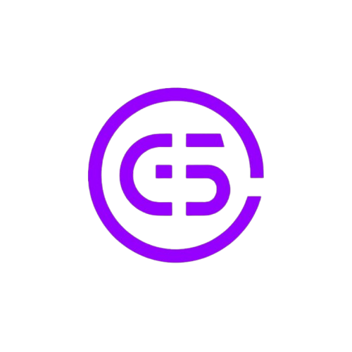

<p align="center">
  
</p>

<h1 align="center">Galyarder Design</h1>

<p align="center">The aesthetic, agent-native design engine for the 1-Man Army.</p>

<p align="center">
  <a href="LICENSE"></a>
  <a href="https://github.com/galyarderlabs/galyarder-design/stargazers"></a>
  <a href="https://github.com/galyarderlabs/galyarder-framework"></a>
</p>

<p align="center">
  Open source · Local-first · No account required · BYOK
</p>

---

The next generation of products won't be designed in pixel-pushing click farms. They'll be built by founders and developers who describe their intent and let agent-native engines render clean, production-ready code.

Galyarder Design is the aesthetic infrastructure for that. A local-first, premium workspace that auto-detects your installed coding agents (Claude Code, Codex, Devin, Cursor, Gemini, and more) and coordinates them through specialized Skills, deterministic visual directions, and on-disk Design Systems. Intent over coordinates. Speed over ritual.

No closed-source clouds, no subscription traps, and no vendor lock-in. Just pure design leverage running 100% on your local machine.

---

## The idea

Most design tools treat AI like a chat bubble floating next to a canvas. That's not a design engine; that's just a junior designer standing over your shoulder.

Real leverage is when your coding agent has a structured environment. When it knows the company's design language, reads deterministic OKLch palettes, follows a five-dimensional self-critique checklist, and writes directly to a working filesystem.

That's what Galyarder Design is built for. We wire the strongest local coding agents on your machine into a governed design engine that streams production-ready visual components.

---

## How it works

You pick a scenario — prototype, landing page, deck, dashboard, or mobile app. Galyarder Design's discovery engine locks your brief (audience, tone, scale) before the model writes a single pixel.

If you don't have a brand book, the picker exposes 5 curated visual directions (Editorial Monocle, Modern Minimal, Warm Soft, Tech Utility, Brutalist Experimental). Each maps to a deterministic palette and font stack — no model freestyling.

The agent wakes up, drafts a live `TodoWrite` plan in your UI, reads the on-disk seed template, runs its self-check, and generates your components inside a sandboxed iframe. Second-round tweaks? You adjust the parameters directly in the tweaks panel, and the agent regenerates the UI.

---

## What you get

**Agent-native workspace**  
A live, interactive UI that showcases todos, tool calls, and execution plans in real-time. Pause, redirect, or tweak mid-flight.

**Agent CLIs supported**  
Auto-detects Claude Code, Codex, Cursor, Devin, Gemini, Hermes, Kimi, OpenCode, Qwen, Qoder, GitHub Copilot CLI, Mistral Vibe, Pi, and others on your `PATH`. Swap your engine with one click.

**150+ design systems built-in**  
Starters, atoms, and comprehensive tokens from world-class systems (Linear, Stripe, Supabase, Apple, Airbnb, Tesla, Notion, and more) to keep all generated work aligned with premium product language.

**130+ production-ready design skills**  
Ready-to-use skills in prototype mode (landings, dashboards, SaaS layouts, iPhone 15 Pro mobile prototypes) and horizontal presentation decks.

**Media & motion generation**  
Generate images, cinematic text-to-video, and HTML-to-MP4 kinetic typography using GPT-Image-2, Seedance, and HyperFrames.

**Local first & self-contained**  
Embedded SQLite database, local directory serving, and POSIX IPC sockets. All project code is stored privately in your workspace.

---

## Quickstart

```bash
git clone https://github.com/galyarderlabs/galyarder-design.git
cd galyarder-design
pnpm install
pnpm tools-dev start
```

Open **http://localhost:7456** in your browser.

**Requirements:** Node.js 24, pnpm 10.33.2+

---

## Supported agents

Claude Code · Codex · Cursor · Devin · Gemini · Hermes · Kimi · OpenCode · Qwen · Qoder · GitHub Copilot CLI · Mistral Vibe · Pi

If it has a CLI and can read files, it works as your Galyarder Design engine.

---

## FAQ

**Where is my design stored?**  
All project assets, files, images, and HTML live directly inside your local directories. Galyarder Design is local-first and does not upload your files to any external cloud.

**How does Galyarder Design connect to my coding agent?**  
The daemon scans your shell's `PATH` to locate the agent executables. When you type a prompt, the daemon sets up the workspace sandbox, writes the discovery requirements, and delegates the execution to the CLI.

**Can I run it without the desktop Electron shell?**  
Yes. Running `pnpm tools-dev start` launches the lightweight background daemon and the web client. You can use it 100% inside your web browser (Chrome, Firefox, Safari) and completely skip the Electron wrapper.

---

## Development

```bash
pnpm tools-dev start     # Start all services (daemon + web + desktop) in background
pnpm tools-dev stop      # Stop all services
pnpm tools-dev status    # View status of active services
pnpm tools-dev restart   # Restart services cleanly
pnpm tools-dev check     # Run quick diagnostics
pnpm guard               # Check workspace style policy and rules
pnpm typecheck           # Run workspace TypeScript checks
```

---

## Contributing

See [CONTRIBUTING.md](CONTRIBUTING.md).

---

## License

Apache-2.0 © 2026 Galyarder Labs

---

<p align="center">
  The future of design isn't pushing pixels. It's building infrastructure.<br>
  <br>
  Open source. Local-first. Built for founders who think in systems.
</p>
